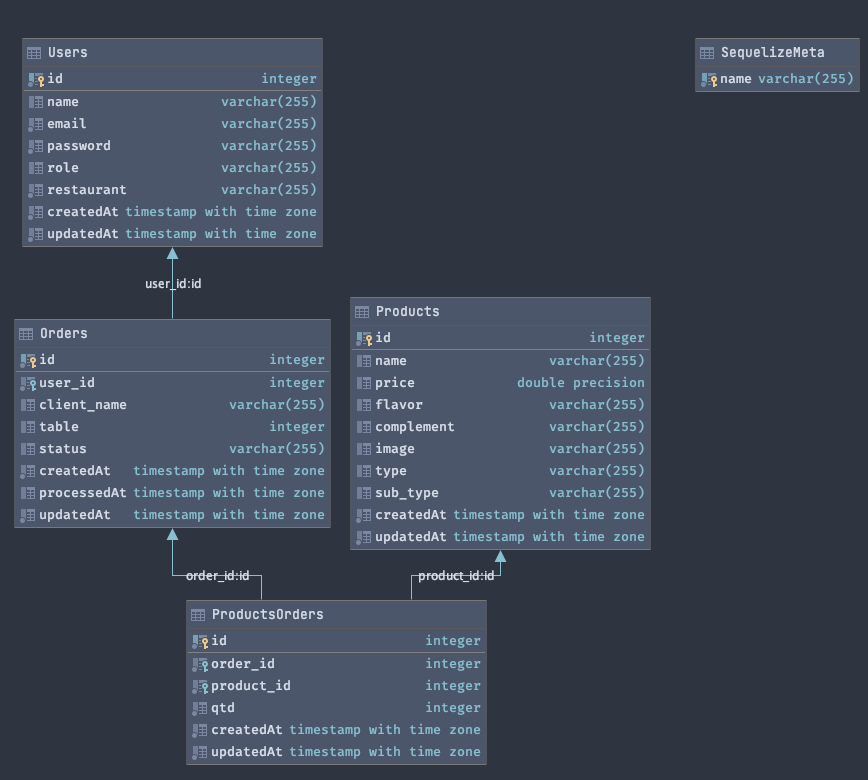

# The Krusty Krab - API com Node.js

Krusty Krab API  - é uma API Rest desenvolvida para administrar os dados de um restaurante. Neste projeto utilizamos NodeJs, PostgreSQL, Express e Sequelize. Para a segurançao do nosso banco, foram utilizados Bcrypt para proteção da senha do usuário e sistema de autenticação utilizando a criação de token JWT. 

Para visualizar, acesse [aqui.](https://krusty-krab-api.herokuapp.com/docs/) 

 
  <h4> senha para acesso: </h4>

|      |          login          |     
|------|-------------------------|
|  📨  |  admin@krustyKrab.com   |
|  🔐  |         123456          |

## Índice

- [1. Resumo](#1-Resumo)
- [2. Proposta do projeto](#2-proposta-do-projeto)
- [3. Diagrama Entidade Relacionamento ](#3-diagrama-entidade-relacionamento)
- [4. Endpoints](#4-endpoints)
- [5. Tecnologias utilizadas](#5-tecnologias-utilizadas)

---

## 1. Resumo

Um pequeno restaurante de hamburgueres, que está crescendo, necessita de um sistema para realizar pedidos usando um tablet, e que os enviem à cozinha para que sejam preparados de forma ordenada e eficiente.

A interface front-end da aplicação Burger Queen já foi criado e pode ser visualizada [aqui](https://krusty-krab-restaurant.herokuapp.com/). Neste projeto criamos o back-end para manejar os dados. O projeto foi desenvolvido através de uma API rest compatível com as requisições vindas do front.

## 2. Proposta do projeto

O objetivo de aprendizagem principal é adquirir experiência com o **Node.js** como ferramenta para desenvolvimento de _aplicações de servidor_, junto com uma série de outras ferramentas comumente utilizadas nesse contexto (Express como framework, PostgreSQL como base de dados, containers de docker (Hacker Edition), etc).

Neste projeto foi desenvolvido um servidor web que esta _servindo_ `JSON` através de uma conexão `HTTP`, e implantado em um servidor na nuvem.

### * Hacker Edition

Neste projeto também foram desenvolvidos alguns dos desafios propostos para a `Hacker edition`. Os desafios concluídos foram:

* Criptografar senha do usuário
* Endpoint de autenticação: `POST /auth`
* Middleware de autenticação - criação e verificação do token
* Criar a documentação da API

#### * Criptografar senha do usuário

É uma boa prática **NÃO** armazenar a senha do seu usuário no seu banco de dados, pois colocaria a segurança de seu usuário em risco. Assim, ao invés de armazená-la como um simples string, foi armazenada uma `hash` criptografada. Para isso,
utilizou-se o [bcryptjs](https://www.npmjs.com/package/bcryptjs).

Assim, na autenticação (`POST /auth`), se a senha do usuário está certa ou não, poderá ser feita
comparando essa `hash`.

#### * Endpoint de autenticação

Um usuário já cadastrado no sistma poderá criar um novo token de acesso ao fazer uma requisição no endpoint /Auth.

#### * Criar token de autenticação JWT

JWT (JSON Web Token) é um método RCT 7519 padrão da indústria para realizar autenticação entre duas partes por meio de um token assinado que autentica uma requisição web. Esse token é um código em Base64 que armazena objetos JSON com os dados que permitem a autenticação da requisição.

Um cliente que enviará uma requisição HTTP ao endpoint de autenticação de uma API. Nela o cliente envia, no corpo da requisição dados como endereço de e-mail e senha. [Fonte](https://www.devmedia.com.br/como-o-jwt-funciona/40265).

#### * Criar a documentação da API

Foi utilizado o [Swagger](https://swagger.io/docs/specification/about/) para escrever a documentação.

## 3. Diagrama Entidade Relacionamento

Em engenharia de software, um modelo entidade relacionamento (MER) é um modelo de dados para descrever os dados ou aspectos de informação de um domínio de negócio ou seus requisitos de processo, de uma maneira abstrata que em última análise se presta a ser implementada em um banco de dados, como um banco de dados relacional. Fonte: Wikipédia.

 

## 4. Endpoints

Conforme o desafio estabelecido no desenvolvimento do desajio, a API possui os seguintes endpoints:

#### 4.1.1 `/users`

* `GET /users`
* `GET /users/:id`
* `POST /users`
* `PUT /users/:id`
* `DELETE /users/:id`

#### 4.1.2 `/products`

* `GET /products`
* `GET /products/:id`
* `POST /products`
* `PUT /products/:id`
* `DELETE /products/:id`

#### 4.1.3 `/orders`

* `GET /orders`
* `GET /orders/:id`
* `POST /orders`
* `PUT /orders/:id`
* `DELETE /orders/:id`

#### 4.1.4 `/auth` (Hacker Edition)

* `POST /auth`

## 5. Tecnologias utilizadas

  <a href="https://github.com/caroAlvim">

  

 
  
  
  
  
  
  
  
  

 

## 

💻  Desenvolvido por [Carolina Alvim](https://www.linkedin.com/in/carolina-alvim/) 
